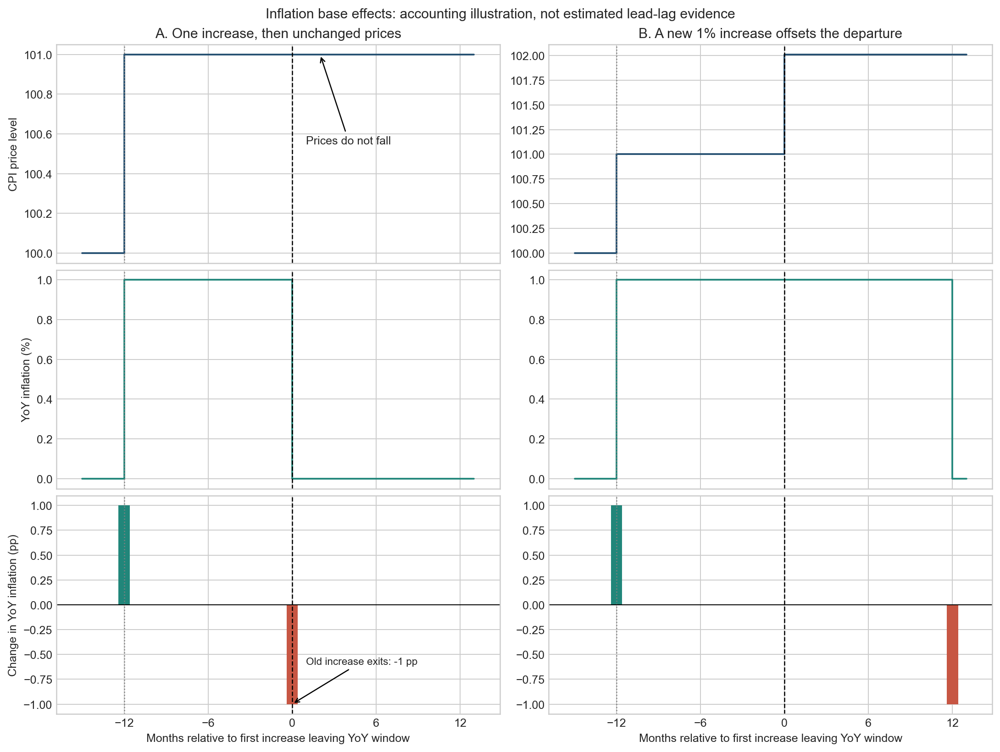
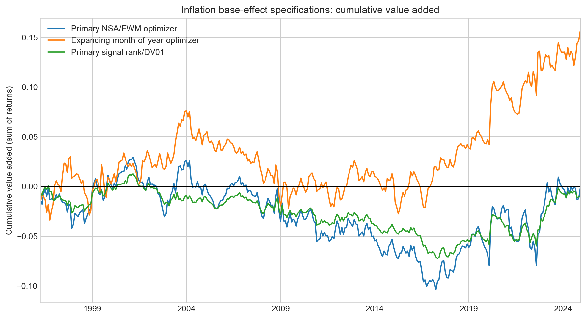
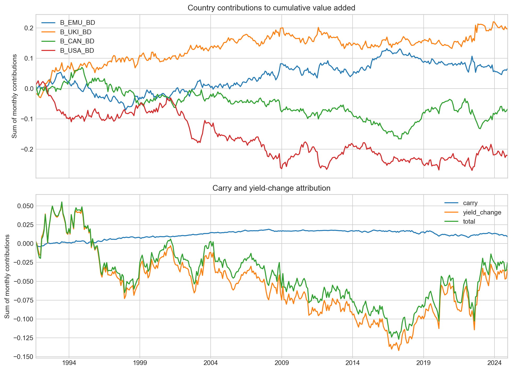
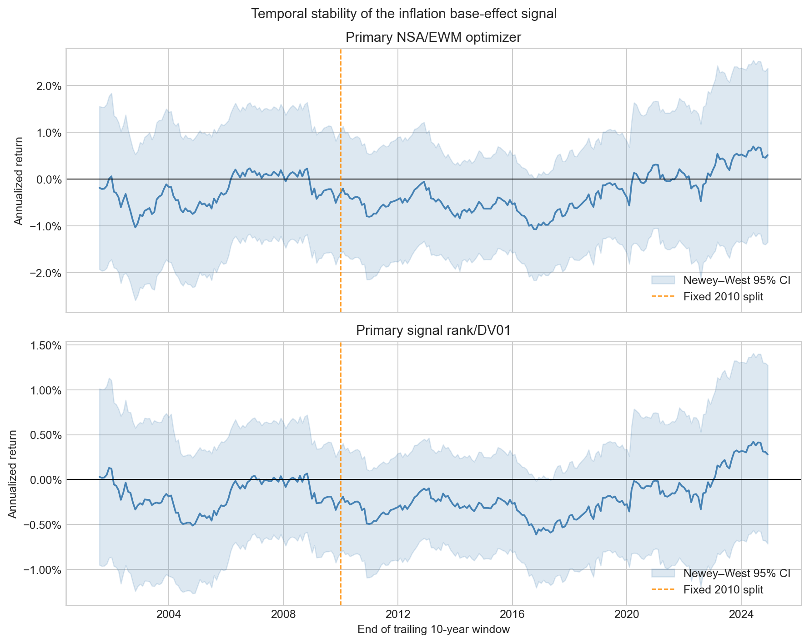

# Can Inflation Base Effects Predict Sovereign Bond Returns?

## A cross-country falsification study

When a large CPI print from 12 months ago drops out of the year-over-year
calculation, reported inflation mechanically falls. This project asks whether
that predictable arithmetic is nevertheless under-priced by sovereign bond
markets.

**Result:** the inherited primary signal does not demonstrate positive bond alpha in
this public-data implementation. The null result is retained rather than
reversing the signal or selecting a favorable specification after the fact.

This is a test of three distinct claims: inflation arithmetic, expectations
adjustment, and bond-return predictability. Only the first is an identity. The
project is not preregistered, and a non-significant result is not proof of zero effect.

## Start with the mechanism



Prices can remain elevated while annual inflation falls. The timing bars show
the **mechanical change in YoY inflation**, not an estimated lead–lag relationship.
A new price increase can offset the old increase leaving the window.

## Research notebooks

| Notebook | What to look for |
|---|---|
| [1. Economic mechanism and data](notebooks/01_data_and_mechanism.ipynb) | Inflation identity, timing illustration, data exploration, forecast-target alignment, US survey evidence |
| [2. Portfolio experiment](notebooks/02_signal_and_backtest.ipynb) | Common-date comparisons, construction, attribution, costs, benchmark adjustment, leave-one-country-out re-estimation, stability |
| [3. Robustness and reconstruction](notebooks/03_robustness_and_reconstruction.ipynb) | Declared sensitivity grids, duration correction, US yield sampling, and a qualified reconciliation with the recovered study |

Notebooks include executed outputs. The primary design stays fixed; the appendix
reports all declared variants without selecting a winner.



## Headline evidence

The primary strategy uses the raw not seasonally adjusted (NSA) CPI print
rolling out of the YoY window, a six-month EWM z-score, a one-month
implementation lag, and a constrained duration-neutral optimizer.

| Specification | Sample | N | Ann. return | Ann. vol. | Return/vol | NW t | NW p |
|---|---:|---:|---:|---:|---:|---:|---:|
| Primary NSA/EWM optimizer | 1991-09 to 2024-12 | 400 | -0.08% | 2.75% | -0.03 | -0.18 | 0.861 |
| Expanding month-of-year optimizer | 1996-04 to 2024-12 | 345 | 0.54% | 2.84% | 0.19 | 1.18 | 0.237 |
| Primary signal, rank/DV01 implementation | 1991-09 to 2024-12 | 400 | -0.02% | 1.42% | -0.01 | -0.09 | 0.928 |

The seasonal robustness variant is mildly positive but statistically
insignificant. It is reported as a diagnostic, not promoted to a replacement
model. The optimizer-free rank/DV01 portfolio is also indistinguishable from
zero.

These are full-history estimates, not identical-date comparisons. On the common
1996-04–2024-12 sample (345 months), the primary mean is approximately **-0.01%**
and the rank/DV01 mean **-0.03%** per year. The primary full-history 95% HAC interval
is approximately **[-0.92%, +0.77%]** per year: the estimate is economically imprecise.
The notebook reports drawdowns, turnover, and uncertainty for both sample conventions.

The proposed expectations mechanism is unsupported as well:

| Forecast revision proxy | N | Coefficient | HAC t | p-value | R² |
|---|---:|---:|---:|---:|---:|
| Michigan monthly revision | 426 | -0.0736 | -1.27 | 0.203 | 0.0050 |
| SPF same-target revision | 143 | -0.0301 | -0.63 | 0.528 | 0.0032 |

The hypothesis requires positive mechanism coefficients under the project's
sign convention. Both estimates have the opposite sign, wide confidence
intervals, and negligible explanatory power.

## Research design

### Signal timing

1. Compute monthly log inflation from NSA CPI price levels.
2. Shift it 12 months to identify the print rolling out of the YoY window.
3. Apply the pre-specified six-month EWM z-score and cap at ±2.
4. Delay implementation by one month.
5. Form holdings at month `t` and earn the complete-case return at `t+1`.

The first month without prior holdings is excluded rather than silently
recorded as a zero return.

### Core robustness checks

- **Real-time seasonal normalization:** each calendar month is standardized
  using only prior observations from that same month, with a five-observation
  warm-up.
- **Optimizer-free benchmark:** the top two signals are long and the bottom two
  short; inverse-duration notionals produce unit gross exposure and exact DV01
  neutrality.
- **HAC inference:** Newey-West standard errors are reported for the strategy
  mean and mechanism regressions.
- **Costs and stability:** the notebook reports fixed-basis-point transaction
  cost scenarios, formal pre/post-2010 HAC tests, and trailing 10-year estimates.
- **Attribution and concentration:** country and carry/yield-change contributions
  reconcile to portfolio P&L; reduced-country portfolios are re-optimized, not
  obtained by subtracting an existing contribution.
- **Incremental value:** an equal-weight long-only bond-proxy benchmark, HAC
  intercept regression, and fixed 50/50 combination separate correlation from alpha.
- **Declared sensitivities:** smoothing, assumed IC, implementation delay,
  covariance estimation, and HAC lags are varied one at a time on common dates.



The UK contributes positively and the US negatively in the original four-country
portfolio. This attribution does not justify ex-post country selection. Positions
are cap-dominated; with four 0.5 position limits, the gross cap of 2 is redundant.
The 10% volatility ceiling is a limit, not a risk target. Duration neutrality is
not currency, funding, or country-factor neutrality.

## Did the signal decay after being priced in?

The data do not support that account. The 2010 split was already present in the
study and is retained as a fixed stability diagnostic rather than selected from
the returns. It is not claimed to be a publication or market-adoption date.

| Implementation and period | N | Ann. return | Ann. vol. | Return/vol | NW t | NW p |
|---|---:|---:|---:|---:|---:|---:|
| Optimizer, pre-2010 | 220 | -0.30% | 2.80% | -0.11 | -0.52 | 0.604 |
| Optimizer, 2010 onward | 180 | 0.20% | 2.70% | 0.08 | 0.30 | 0.765 |
| Rank/DV01, pre-2010 | 220 | -0.13% | 1.45% | -0.09 | -0.43 | 0.670 |
| Rank/DV01, 2010 onward | 180 | 0.11% | 1.38% | 0.08 | 0.31 | 0.755 |

The annualized post-minus-pre change is **+0.51%** for the optimizer
(`t = 0.59`, `p = 0.558`) and **+0.25%** for the rank/DV01 portfolio
(`t = 0.52`, `p = 0.601`). Both changes are positive and statistically
insignificant. The evidence therefore indicates neither historical positive
alpha nor subsequent decay.



The rolling windows overlap and are descriptive. They show how imprecisely
performance varies through time, but they are not independent tests and cannot
identify when investors may have learned the signal.

## Data and reproducibility

The showcased run uses the committed snapshot in
`data/snapshots/2026-09-28/`. Its manifest records source identifiers, coverage,
retrieval time, and SHA-256 checksums. This makes the saved result reproducible
without a FRED key or dependence on future source revisions.

The supplementary `data/supplementary/2026-10-01/` snapshot freezes public
GS10/DGS10 observations with separate provenance and SHA-256 checksums. It is used
only for the US yield-sampling diagnostic, never to overwrite primary inputs.

### Reconstruction and verified corrections

The appendix records the original scanned result (approximately -0.60% annually),
the preceding public implementation (approximately -0.08%), and controlled
comparisons. The original downloaded vintage is unavailable, so this is **not an
exact replication bridge** and changes are not claimed to sum to the historical gap.

The low/negative-yield duration shortcut has been replaced by a continuous,
numerically stable formula. A same-input legacy-rule run reproduces the preceding
public result and isolates the small correction; the research conclusion is unchanged.
Implementation delays now move calendar labels, preserving the last eligible
print for shorter country histories without changing the primary sample.

Monthly averages versus month-end yields matter: replacing only US yields with
month-end observations yields about -0.45% annually in a mixed-sampling diagnostic.
This does not establish causality for the original result gap or make the full
cross-country proxy executable. Historical vintage reconstruction remains deferred.

| Dataset | Source | Frequency |
|---|---|---|
| CPI price levels, NSA | FRED / OECD | Monthly |
| 10Y government bond yields | FRED / OECD | Monthly averages |
| Inflation expectations | University of Michigan via FRED | Monthly |
| CPI forecast revisions | Philadelphia Fed SPF | Quarterly |

The US yield series is monthly [`GS10`](https://fred.stlouisfed.org/series/GS10),
an average of business-day observations, rather than a month-end resampling of
daily `DGS10`. SPF revisions use official
[deadline and release-date documentation](https://www.philadelphiafed.org/-/media/frbp/assets/surveys-and-data/survey-of-professional-forecasters/spf-documentation.pdf).

The common-country signal ends in 2024-12 because the referenced OECD CPI
series for Germany, the UK, and Canada end in 2023-11; those observations can
identify prints rolling off through the following 12 months.

## Reproduce the study

Python 3.10 and [`uv`](https://docs.astral.sh/uv/) are required.

```bash
uv sync --locked --all-extras
uv run pytest -q
uv run jupyter nbconvert --to notebook --execute --inplace \
  --ExecutePreprocessor.timeout=1800 \
  notebooks/01_data_and_mechanism.ipynb \
  notebooks/02_signal_and_backtest.ipynb \
  notebooks/03_robustness_and_reconstruction.ipynb
```

To create a new dated snapshot from the official sources:

```bash
cp .env.example .env
# Add a free FRED_API_KEY to .env
uv run python scripts/refresh_data.py --date YYYY-MM-DD
```

Refreshes never overwrite an existing non-empty snapshot. HTTPS certificate
verification remains enabled; corporate CA bundles can be supplied through
`SSL_CERT_FILE`.

The separate public-yield snapshot can be refreshed to a **new** dated directory
with `uv run python scripts/freeze_us_yields.py --date YYYY-MM-DD` (no API key).
Notebooks deliberately keep their documented snapshot dates until explicitly revised.
CI runs formatting, lint, tests, all three frozen-data notebooks, and package build.

## Repository structure

```text
.
├── data/snapshots/2026-09-28/   # Frozen public-data inputs and manifest
├── data/supplementary/2026-10-01/ # Separate US yield sampling inputs
├── docs/figures/                 # README research figure
├── notebooks/
│   ├── 01_data_and_mechanism.ipynb
│   ├── 02_signal_and_backtest.ipynb
│   └── 03_robustness_and_reconstruction.ipynb
├── scripts/refresh_data.py       # Explicit, non-overwriting live refresh
├── src/inflation_base_effects/
│   ├── data.py
│   ├── signals.py
│   ├── portfolio.py
│   ├── evaluation.py
│   └── research.py
└── tests/                        # Timing, data, constraints, and robustness
```

## Limitations

- Returns are `carry - duration × yield change` approximations, not futures or
  total-return indices.
- Monthly-average yields cannot identify announcement-day market adjustment.
- Proxy returns omit convexity, actual instrument cash flows, funding, and FX hedges.
  Additive value added is reference-notional P&L, not a funded reinvested wealth index.
- Current-vintage CPI histories may differ from the real-time values available
  to investors.
- The four-country optimizer remains position-cap dominated.
- Michigan expectations change forecast horizon; SPF evidence is US-only.
- Transaction costs are illustrative fixed-basis-point scenarios.
- A positive robustness point estimate is not an untouched discovery sample.
- The 2010 split is a fixed diagnostic rather than a causal market-adoption
  date; overlapping rolling windows are descriptive.

## What the project demonstrates

- translating an economic mechanism into an explicitly timed signal;
- separating a pre-specified test from post-hoc diagnostics;
- constrained portfolio construction and an optimizer-free benchmark;
- complete-case return accounting, HAC inference, mechanism tests, and a
  disciplined temporal-stability analysis;
- reproducible research with frozen inputs, tested code, and honest reporting
  of a failed hypothesis.

## License

MIT — see [LICENSE](LICENSE).
